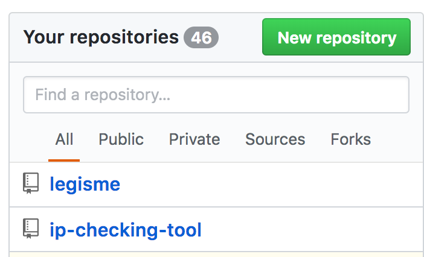
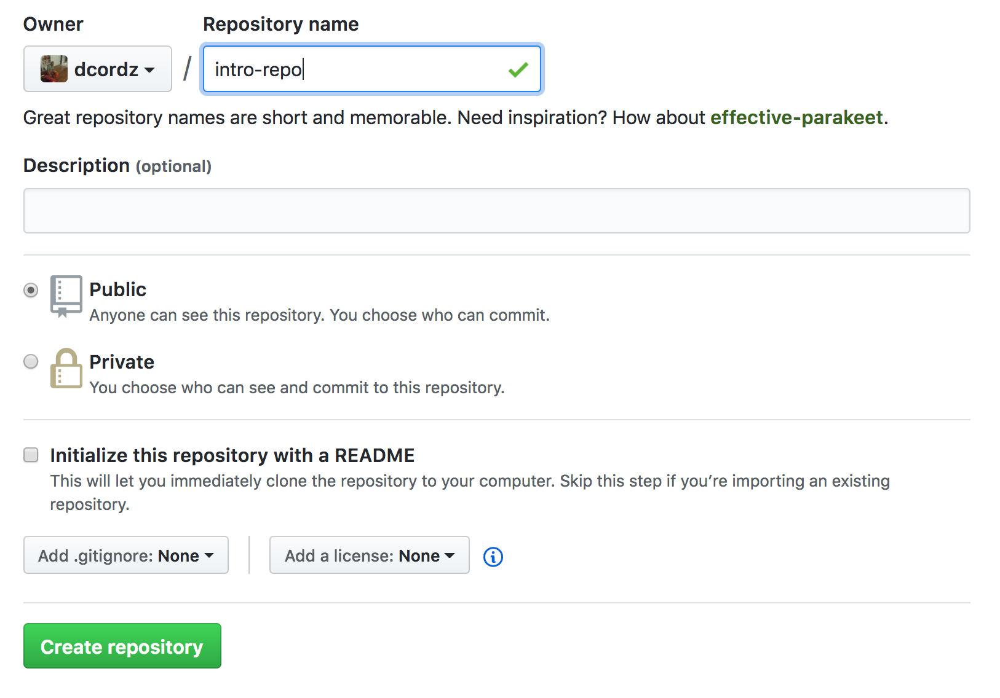
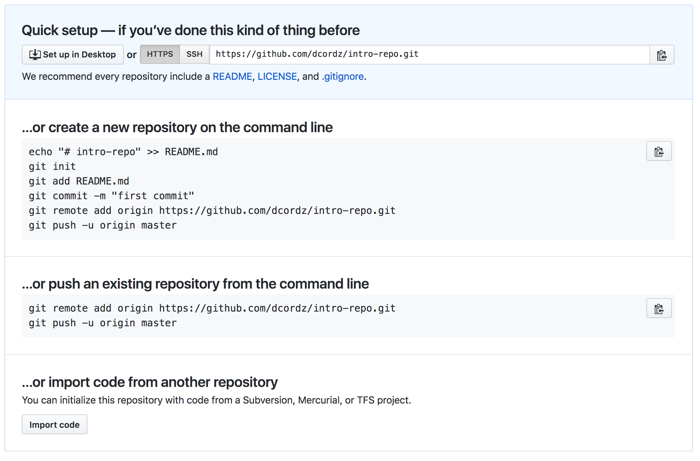
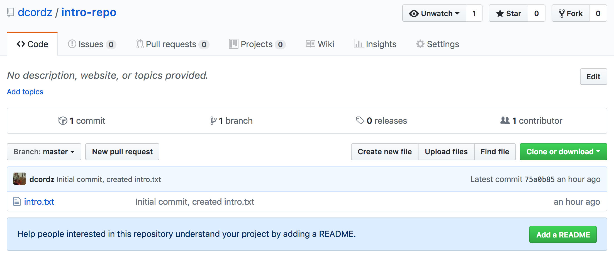

# Introduction to Git and Github

## What is Git?
Git is a Version Control System (VCS), which allows us to monitor *changes* to a file. The emphasis on *changes* is important here because we're not monitoring the content of a file, only how that content differs from one `commit` to another.

Git uses a [Diffing Algorithm](http://www.xmailserver.org/diff2.pdf) for detecting changes in your files.

## What is Github?
Github and Git are not the same thing although they start with the same three letters. While Git is the tool we use to monitor changes in a document. Github is, in their own words, "a community where more than 28 million people learn, share, and work together to build software." In other words, Github is where we store our code. Much like Dropbox is a place where you store files, Github is a place where you store Git `commits`.

### What's a `Commit`?
Commits are the meat of Git. A commit is essentially a collection of changes that have happened to the files in our `repository` since the last `commit`. This may seem circular, but most people start a project with an initial `commit`. For example, lets start a new project.

In your CLI run:
```
cd ~
mkdir git-intro
cd git-intro
git init
touch intro.txt
```

At this point, what we've done is:
```
Changed directory to our home directory

Made a new directory called `git-intro`

Changed directory into `git-intro`

Initialized a new Git repository, the directory `git-intro` is now a git repo

Created a new file called `intro.txt`
```
If you run `ls -al` you can see that `.git` is a new directory that has been added to your directory.

Now run `git status` to see what the current status of our git `repo` is. You should see something like this:
```
On branch master

No commits yet

Untracked files:
  (use "git add <file>..." to include in what will be committed)

	intro.txt

nothing added to commit but untracked files present (use "git add" to track)
```

Git is waiting for us to begin tracking our new file, which we can do with with `git add intro.txt`. We could also use `git add .` which means `Add all changes`, but this can be a dangerous command to run. Sometimes we won't want to track a file, such as a file that contains API Keys.

After adding our new file to be tracked, what some people call `Staging`, we can go about our business knowing that Git will be watching for changes. Lets run some commands.

After adding the file, run `git status` again, you should see something like this:

```
On branch master

No commits yet

Changes to be committed:
  (use "git rm --cached <file>..." to unstage)

	new file:   intro.txt
```

Notice that the line `Untracked files:` from the first time we ran `git status` changed to `Changes to be committed:`. We can now make our first commit!

Lets run:
```
git commit -m "Initial commit, created intro.txt"
git status
git log
```

The output from these commands should be as follows:
```
[master (root-commit) 75a0b85] Initial commit, created intro.txt
 1 file changed, 0 insertions(+), 0 deletions(-)
 create mode 100644 intro.txt

On branch master
nothing to commit, working tree clean

commit 75a0b85f3255ef4761fcb6083796752534af74c5 (HEAD -> master)
Author: you <you@your_email_address.com>
Date:   Fri Feb 9 04:30:36 2018 -0500

    Initial commit, created intro.txt
```

Lets recap those commands:
1. Commited our changes, which included the creation of a new file, `intro.txt`
2. After running `git status` we can see that our `working tree` is clean, meaning there is nothing in our `staging` area and there have been no changes to the files we are tracking.
3. We can see what commits have been made and by whom in the past. This is a critical part of git because it allows us to rollback changes in case those changes break our application.

Now that we've made our first commit, lets make another.

```
echo "This is a new line that Git will detect as a change to the file." > intro.txt
touch second-intro.txt
git status
```

Results in:
```
On branch master
Changes not staged for commit:
  (use "git add <file>..." to update what will be committed)
  (use "git checkout -- <file>..." to discard changes in working directory)

	modified:   intro.txt

Untracked files:
  (use "git add <file>..." to include in what will be committed)

	second-intro.txt

no changes added to commit (use "git add" and/or "git commit -a")
```

Git has detected changes in our `intro.txt` file and has also discovered a new file `second-intro.txt`. We *could* use `git add .` to add both files to another commit but how can we have two introductions? Lets only add the first one.

```
git add -u
git status
git commit -m "Added a line to the tracked file, not tracking a newly created file."
git status
git log
rm second-intro.txt
```
Using `git add -u` we only `staged` our changes in `intro.txt` for this second commit and refused to track `second-intro.txt`. Running `git status` can confirm this.

### Integrating with Github

Notice that we haven't touched Github at this point, everything we've done has been on our local machine. Let's push our changes up to Github so other people can follow the changes we've made.

1. In your browser go to https://github.com/
2. Click the `New repository` button on the right, inside of the `Your repositories` menu.



####3. This should take you to a new repository creation screen which should look something like this:



####4. Enter in a name for the repository and click the `Create repository` button, which should bring you to...



5. Leave the URL as HTTPS and click the clipboard icon for the second option, `push an existing repository from the command line` since we have a git repo already. This should copy the code to the clipboard.

Head over to your command line and paste in the commands from Github. Once done you should see the following:

```
Counting objects: 3, done.
Writing objects: 100% (3/3), 218 bytes | 218.00 KiB/s, done.
Total 3 (delta 0), reused 0 (delta 0)
To https://github.com/dcordz/intro-repo.git
 * [new branch]      master -> master
Branch master set up to track remote branch master from origin.
```
What this tells us is that Github has successfully uploaded our repository and created a new Github branch, `master` which matches our local branch, also called `master`.

If you click the `Code` tab in Github you'll be taken to a screen like this:



From this screen we can do a ton of things but for now lets focus on the button that says `Clone or download`. Click it and copy the url snippet it gives you. Now run,

```
cd ~
rm -rf git-intro
git clone https://github.com/dcordz/intro-repo.git # the url you copied will be different
cd git-intro
```

What we've done here is to destroy and then `clone` down our git repo from Github.

As a final step, lets make a change and push it up to Github.

```
git checkout -b intro
echo "Adding a new line for pushing up to Github" < intro.txt
git status
git add -u
git status
git commit -m "created a new branch and added a line for tracking"
git push origin intro
git checkout master
git merge intro
git push origin master
```

That's it! We should now see our new changes reflected in our Github repository along with our new branch `intro`, which should match the code in `master`.

## Useful commands

#### Git
```
git init # Initialize a new git repository
git add # add untracked files and changes to tracked files to Staging
git commit # add changes to a new commit, use the -m flag to include a commit message from the command line
git checkout # switch to a new branch, add the -b flag to create a new branch
git merge <from_branch> # merge changes from one branch into your working branch
git log # see past commits
git status # see the current status of commit, what changes have been added to changing
```

#### Git with Github
```
git push <remote> <branch> # push code from <branch> to the <remote> where your repository is hosted.
git pull <remote> <branch> # pull code from <branch> that is hosted by <remote> and merge it into your local repository. Can lead to merge conflicts.
git clone <url> # copies a repository from a remote repository to the environment you're working in
```
